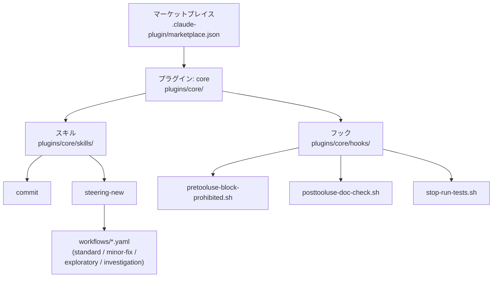
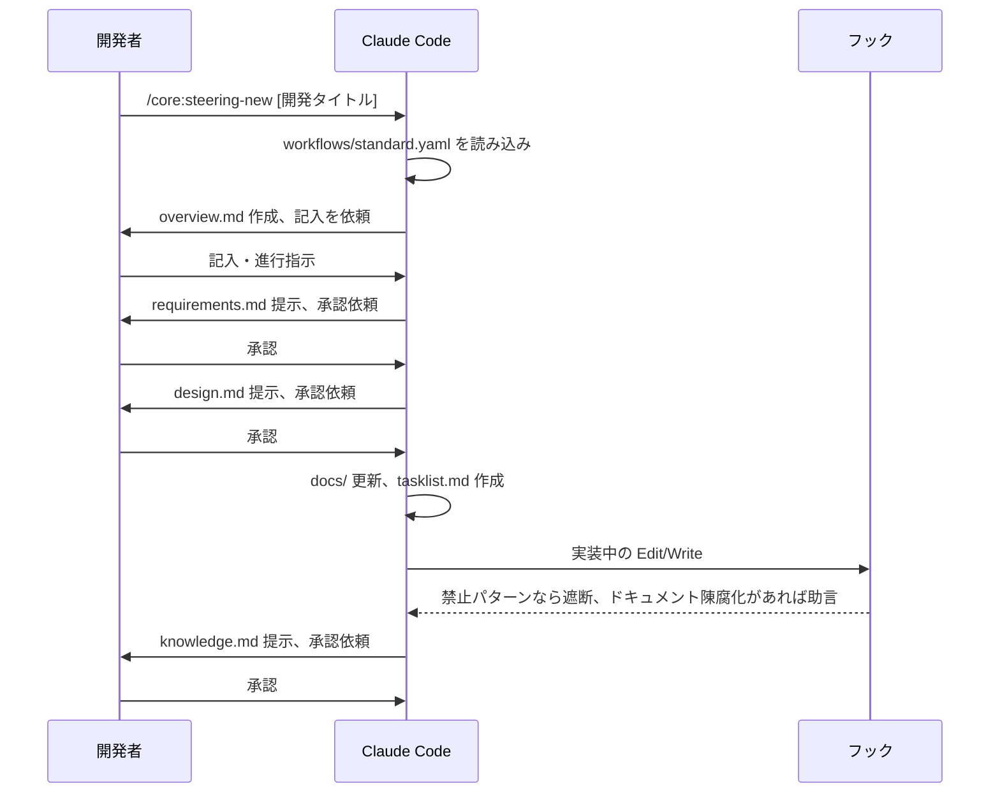

# 機能設計書

## 機能ごとのアーキテクチャ

### スキル(プロンプト駆動)

`plugins/core/skills/<スキル名>/SKILL.md` に、フロントマター(`description`/`argument-hint`)と、Claude が実行時に読む自然言語の手順を記述する。`SKILL.md` 自体がスキルの実装であり、コンパイルやビルドを介さず Claude がそのまま読んで解釈する。

`steering-new` スキルはこれに加えて `plugins/core/skills/steering-new/workflows/*.yaml` を持つ。`SKILL.md` はワークフローエンジンの共通ロジック(引数解析・ゲート種別・手順種別 `kind` の意味)のみを定義し、`--workflow=<id>` で選択したワークフロー YAML が「どの `kind` をどの順序で・どのゲートで実行するか」を宣言する。手順の追加・調整は YAML ファイルの追加・変更で完結し、`SKILL.md` 本文の書き換えを必要としない。

### フック(シェルスクリプト)

`plugins/core/hooks/hooks.json` が、どのイベント(`PreToolUse`/`PostToolUse`/`Stop` など)でどのスクリプトを実行するかを宣言する。各スクリプトは `plugins/core/hooks/*.sh` に置かれた独立したシェルスクリプトで、標準入力から渡されるツール呼び出し情報を見て、ブロック(exit code)または助言(標準エラー出力)を返す。

## システム構成図

利用側リポジトリは `claude plugin marketplace add` でこのリポジトリをマーケットプレイスとして登録し、`claude plugin install core@claude-code-toolkit` で `core` プラグインを導入する。プラグイン機構の対象外の設定(`.claude/settings.json` の `permissions`/`sandbox`、`claude.md`、`.devcontainer/devcontainer.json`)は、利用側リポジトリがこのリポジトリの実体を参照してコピーする。

## データモデル定義(ER図含む)

該当なし。このリポジトリはデータベースを持たない(設定・スキル・フックはすべてファイルベース)。

## コンポーネント設計

| コンポーネント | 役割 |
|---|---|
| `commit` スキル | このリポジトリのコミット規約に従ってコミットを作成する。ステアリングを伴う変更はディレクトリ名をそのままタイトルに使う |
| `steering-new` スキル | `.steering/[YYYYMMDD]-[NN]-[開発タイトル]/` を作成し、ワークフロー(`standard`/`minor-fix`/`exploratory`/`investigation`)に応じた手順で要求・設計・タスク・学びを記録する |
| `pretooluse-block-prohibited.sh` | `permissions.deny`/`ask` の宣言的パターンでは表現しきれない、コマンド文字列レベルの禁止事項を遮断する |
| `posttooluse-doc-check.sh` | コードの変更(Edit\|Write)で削除・変更された識別子が `docs/*.md` や `README*.md` に残っていないか助言する(ブロックはしない) |
| `stop-run-tests.sh` | `.claude/test-command` があればそれに従ってテストを実行し、失敗時はターンの終了をブロックする |

## ユースケース図、画面遷移図、ワイヤフレーム

画面遷移図・ワイヤーフレームは該当なし(GUI を持たない CLI 向け設定配布リポジトリのため)。

代表的なユースケースの流れ:

## API設計

該当なし。将来的にバックエンドと連携する予定はない(ローカルのファイル操作と Git 操作のみで完結する)。
