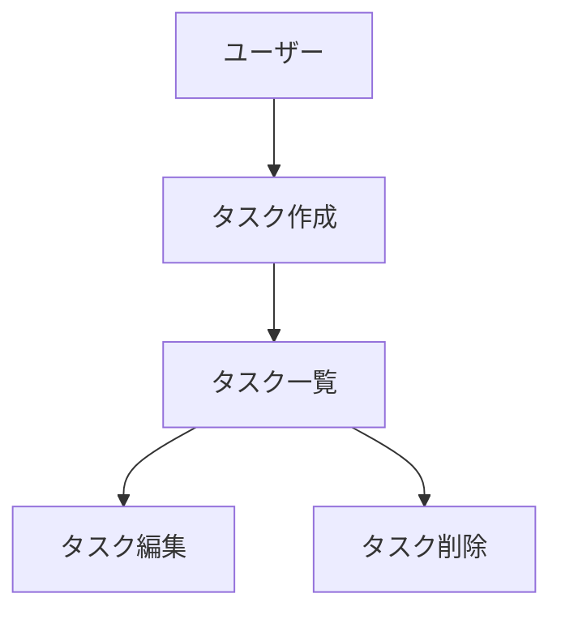

# CLAUDE.md (プロジェクトメモリ)

## 概要

開発を進めるうえで遵守すべき標準ルールを定義します。

## プロジェクト構造

### ドキュメントの分類

#### 1. 永続的ドキュメント（`docs/`）

アプリケーション全体の「**何を作るか**」「**どう作るか**」を定義する恒久的なドキュメント。
アプリケーションの基本設計や方針が変わらない限り更新されません。

- **product-requirements**.md - プロダクト要求定義書
  - プロダクトビジョンと目的
  - ターゲットユーザーと課題・ニーズ
  - 主要な機能一覧
  - 機能要件
  - 非機能要件
- **functional-design**.md - 機能設計書
  - 機能ごとのアーキテクチャ
  - システム構成図
  - データモデル定義（ER図含む）
  - コンポーネント設計
  - ユースケース図、画面遷移図、ワイヤフレーム
  - API設計（将来的にバックエンドと連携する場合）
- **architecture**.md - 技術仕様書
  - テクノロジースタック
  - 開発ツールと手法
  - 技術的制約と要件
  - パフォーマンス要件
- **repository-structure**.md - リポジトリ構造定義書（未作成）
  - フォルダ・ファイル構成
  - ディレクトリの役割
  - ファイル配置ルール
- **glossary**.md - ユビキタス言語定義（未作成）
  - ドメイン用語の定義
  - ビジネス用語の定義
  - UI/UX用語の定義
  - 英語・日本語対応表
  - コード上の命名規則

#### 2. 作業単位のドキュメント（`.steering/[YYYYMMDD]-[NN]-[開発タイトル]/`）

特定の開発作業における「**今回何をするか**」を定義する一時的なステアリングファイル(requirements.md / design.md / tasklist.md)。
作成要否はユーザーが判断する。作成する場合は `/core:steering-new [開発タイトル]` スキルを使う(ファイル構成・命名規則・作成手順は `plugins/core/skills/steering-new/SKILL.md` を参照)。

`NN` は同日内の連番(`01` から)。日付だけではディレクトリ名のソート順が作成順と一致しないため付与する。

## 開発プロセス

### 技術選定の原則

**常に最新の安定版（Stable）を採用する**

プログラミング言語、フレームワーク、ライブラリ、CI/CD環境を選定する際は、以下の原則に従ってください。

1. **最新の安定版を採用**
   - 新規プロジェクト開始時、または新しい依存関係を追加する際は、その時点での最新安定版を選択する
   - ベータ版やRC版は、明確な理由がない限り採用しない

2. **対象範囲**
   - プログラミング言語（Go, Node.js, Python など）
   - フレームワーク・ライブラリ
   - CI/CD環境（GitHub Actions のランナーイメージ、actions/* など）
   - 開発ツール（linter, formatter など）

3. **古いバージョンを避ける理由**
   - 後からのアップグレードは追加の作業コストが発生する
   - セキュリティパッチや機能改善の恩恵を受けられない
   - 依存ライブラリとの互換性問題が発生しやすい

4. **バージョン確認の習慣化**
   - 技術選定時に公式サイトで最新安定版を確認する
   - CI/CDワークフロー作成時もランナーやアクションの最新バージョンを確認する

5. **メンテナンス状況の確認**
   - アーカイブされたプロジェクトや、メンテナンスが停止しているライブラリは採用しない
   - 既存の依存関係がアーカイブされた場合は、後継ライブラリや代替ライブラリへの移行を検討する
   - 確認ポイント:
     - GitHubリポジトリの「Archived」ステータス
     - 最終コミット・リリース日
     - Issue/PRへの対応状況
     - 公式な後継プロジェクトの有無

---

### 初回セットアップ時の手順

#### 1. フォルダ作成
```bash
mkdir -p docs
```

#### 2. 永続的ドキュメント作成（`docs/`）

アプリケーション全体の設計を定義します。
各ドキュメントを作成後、必ず確認・承認を得てから次に進みます。

1. `docs/REQUIREMENTS_SUMMARY.md` - プロダクト要求定義書
2. `docs/DESIGN.md` - 設計書（概要）
3. `docs/SPEC.md` - 技術仕様書（概要）
4. `docs/repository-structure.md` - リポジトリ構造定義書
6. `docs/glossary.md` - ユビキタス言語定義

**重要：** 1ファイルごとに作成後、必ず確認・承認を得てから次のファイル作成を行う

#### 3. 初回実装用のステアリングファイル作成

初回実装についてステアリングドキュメントを作成する場合は `/core:steering-new` コマンドを使う。

#### 4. 環境セットアップ

#### 5. 実装開始

`.steering/[YYYYMMDD]-[NN]-initial-implementation/tasklist.md` に基づいて実装を進めます。

#### 6. 品質チェック

「テストの実行」に従う。テストを整備した時点で `.claude/test-command` を作成する。

### 機能追加・修正時の手順

**ステップの順序は 影響分析 → ステアリング作成(requirements → design → 永続的ドキュメント更新 → tasklist) → 実装 → 品質チェック で固定する。** 永続的ドキュメント（`docs/`）の更新は実装より前に行い、実装完了後に後回しにしない。requirements / design / 永続的ドキュメント更新の各ステップは、ユーザーから明示的な承認の返答を得るまで次のステップへ進まない。tasklist.md は承認ステップではなく、作成したらそのまま実装に進む。

#### 1. 影響分析

- 永続的ドキュメント（`docs/`）への影響を確認

#### 2. ステアリングドキュメント作成(該当する場合)

作成要否はユーザーが判断する。作成する場合は `/core:steering-new [開発タイトル]` スキルを使う(`plugins/core/skills/steering-new/SKILL.md` 参照)。このスキル内で requirements.md → design.md → 永続的ドキュメント（`docs/`）更新 の順に段階承認しながら進め、承認後に tasklist.md を作成する。永続的ドキュメントの更新はこのステップ内(実装着手前)で完了させる。

**永続的ドキュメントの更新対象の候補：**
- `docs/` - 設計書、仕様書
- `README.md` / `README.*.md` - 使用例、機能説明
- サブディレクトリの `README.md`
- `CHANGELOG.md` - 変更履歴(`[Unreleased]` セクション)

#### 3. 実装開始

永続的ドキュメント（`docs/`）更新の承認を得たうえで tasklist.md を作成したら、tasklist.md の承認は待たずに着手する。`.steering/[YYYYMMDD]-[NN]-[開発タイトル]/tasklist.md` に基づいて実装を進める。この時点で `docs/` 更新は完了済みのため、実装フェーズで `docs/` を更新することは基本的にない(実装中に想定外の設計差異が判明した場合は、その場で完結させず一度ユーザーに報告し、`docs/` 更新の要否を相談する)。

#### 4. 品質チェック

「テストの実行」に従う。

## テストの実行

テストの実行コマンドはリポジトリごとに異なるため、この設定一式には持たせない。**リポジトリルートの `.claude/test-command` に 1 行で書く。**

```text
python3 -m unittest discover -s tests
```

- Stop フック(`plugins/core/hooks/stop-run-tests.sh`)がこのファイルを読んでテストを実行し、失敗した場合はターンの終了をブロックする
- ファイルが存在しないリポジトリでは、テストを実行せずそのまま終了する。テストを持たないリポジトリでフックが誤って止めることはない
- コマンドはシェル経由で実行するため、パイプや複数コマンドの連結も書ける

## ドキュメント管理の原則

### 永続的ドキュメント（`docs/`）
- アプリケーションの基本設計を記述
- 頻繁に更新されない
- 大きな設計変更時のみ更新
- プロジェクト全体の「北極星」として機能

### 作業単位のドキュメント（`.steering/`）
- 特定の作業・変更に特化
- 作業ごとに新しいディレクトリを作成
- 作業完了後は履歴として保持
- 変更の意図と経緯を記録

## 図表・ダイアグラムの記載ルール

### 記載場所
設計図やダイアグラムは、関連する永続的ドキュメント内に直接記載します。
独立したdiagramsフォルダは作成せず、手間を最小限に抑えます。

**配置例：**
- ER図、データモデル図 → `functional-design.md` 内に記載
- ユースケース図 → `functional-design.md` または `product-requirements.md` 内に記載
- 画面遷移図、ワイヤフレーム → `functional-design.md` 内に記載
- システム構成図 → `functional-design.md` または `architecture.md` 内に記載

### 記述形式
1. **Mermaid記法（推奨）**
   - Markdownに直接埋め込める
   - バージョン管理が容易
   - ツール不要で編集可能



2. **ASCII アート**
   - シンプルな図表に使用
   - テキストエディタで編集可能

```
┌─────────────┐
│   Header    │
└─────────────┘
       │
       ↓
┌─────────────┐
│  Task List  │
└─────────────┘
```

3. **画像ファイル（必要な場合のみ）**
   - 複雑なワイヤフレームやモックアップ
   - `docs/images/` フォルダに配置
   - PNG または SVG 形式を推奨

### 図表の更新
- 設計変更時は対応する図表も同時に更新
- 図表とコードの乖離を防ぐ

## バージョニングと後方互換性ポリシー

### 基本方針

**セマンティックバージョニング（Semantic Versioning）** に準拠します。

```
<major>.<minor>.<patch>[-<pre-release>]

例:
1.0.0       # 安定版
0.1.0-beta  # ベータ版
0.2.0-rc.1  # リリース候補
```

### リリース段階別の後方互換性ポリシー

#### ベータ版（0.x.x-beta）

**後方互換性は担保しない**

**後方互換性が不要な場合の開発指針:**
- 破壊的変更（Breaking Changes）を自由に行える
- 後方互換性のためのレガシーコードを残さない
- 設計の最適化を優先し、技術的負債を最小化

#### 安定版（1.0.0以降）

**後方互換性: 厳密に管理**

**バージョンアップの原則:**
- **Major**: 破壊的変更が許可される（詳細な移行ガイド必須）
- **Minor**: 後方互換性を維持した機能追加のみ
- **Patch**: 後方互換性を維持したバグ修正のみ

### バージョン管理の実践

#### バージョン更新時の確認事項

1. **変更内容の分類**
   - 既存機能の動作が変わるか？ → Major
   - 新機能を追加するか？ → Minor
   - バグ修正のみか？ → Patch

2. **ベータ版での注意点**
   - プロジェクト開始時に決定したポリシーに従う
   - 後方互換性が不要な場合は、設計のシンプルさを最優先

3. **安定版での注意点**
   - 破壊的変更は慎重に検討
   - 非推奨（Deprecated）機能を先に導入
   - 詳細な移行ガイドをCHANGELOGに記載

### プロジェクト固有の詳細

上記は汎用的なポリシーです。プロジェクト固有の詳細（バージョン番号の管理場所、更新手順など）は `docs/development-guidelines.md` に記載してください。

---

## 開発環境の権限設定

Claude Code の権限は `.claude/settings.json` の `permissions` と `plugins/core/hooks/pretooluse-block-prohibited.sh`(`core` プラグインの PreToolUse フック)で定義する。運用ルールは次の 4 つ。

1. **既定はすべて承認なし** - `permissions.defaultMode` は `bypassPermissions`。禁止事項に当たらない操作は承認を求めない。開発コンテナでの利用であり、コンテナ外部のファイルシステムに到達できないことが前提
2. **禁止事項だけを列挙する** - allow リストは使わない(`bypassPermissions` では無効)。「載せ漏れが承認待ちになる」構造そのものを持たない
3. **サンドボックスは使わない** - 本コンテナでは bubblewrap がユーザー名前空間を作成できず起動しないため。`sandbox` は `{"enabled": false}` で意図を明示している
4. **禁止事項は Git 管理で永続化する** - `.claude/settings.json` と `plugins/core/hooks/` に置き、開発コンテナの再作成後も維持する。`.claude/settings.local.json` はグローバル無視されるため恒久ルールの置き場所にしない

### 禁止事項の担い手

| 層 | 担当 | 理由 |
|---|---|---|
| `permissions.deny` | パス(Edit / Write / Read の対象ファイル) | 宣言的で、スクリプトを消しても効き続ける |
| PreToolUse フック | Bash のコマンド文字列 | 前方一致グロブでは表現しきれない条件を扱える |

フックは `bypassPermissions` でも実行され、その `deny` はモードに優先する。フックは**止めるものだけを列挙**し、通す判断は返さない。

### 拒否するもの

基準は「Git 管理下かどうか」ではなく「**Claude が自分の権限や実行環境を書き換えられる経路かどうか**」である。

- `.claude/settings.json` / `.claude/settings.local.json` - 権限設定そのもの
- `plugins/*/hooks/` - 禁止を担うスクリプトと、毎ターン実行される Stop / PostToolUse スクリプト
- `plugins/*/.claude-plugin/` - プラグインマニフェスト。コンポーネントの読み込み先を制御するため、書き換えられると `hooks/` の保護を迂回されうる
- `.devcontainer/` - コンテナ構成。サンドボックスのために seccomp を緩めない判断を覆せないようにする
- `.git/`(組み込みファイルツール経由)- コミット履歴と Git フック。`git` コマンド経由の操作は対象外
- `~/.ssh/` / `~/.config/git/` / `~/.gitconfig` / `~/.bashrc` / `~/.profile` / `~/.claude/settings.json` / `~/.local/share/claude/`
- パッケージのインストール(`apt-get install` / `pip install` / `npm install -g`)- Git 管理外の環境を変える

**これらの変更はユーザー自身が行う。** Claude は変更内容を提案するに留める。

`.claude/skills/` / `.claude/commands/` / `plugins/*/skills/` / `plugins/*/assets/` は拒否しない。スキルの改訂やテンプレート資産の更新は本リポジトリの通常の開発行為であり、Git の差分でレビューできるため。

またリモート Git 操作(`push` / `fetch` / `pull` / `clone` / `remote`)を拒否する。ローカルで完結しない変更をユーザーの確認なしに送り出さないため。

クラウド API を操作する CLI(`aws` / `gcloud` / `az` など)と、それに対応する `WebFetch` のドメインを拒否するかは、リポジトリごとに決める。インフラを含むリポジトリでは、実デプロイと状態確認をユーザーが行う前提でこれらを拒否する。

### 承認を挟むもの

「Git 管理しているから復元可能」が成り立つのは、**コミット済みかつ追跡対象のファイル**に限られる。その外を壊す操作は、禁止すると復旧作業ができなくなるため、拒否ではなく承認を挟む。

- `git clean` - 未追跡・`.gitignore` 対象ファイルを消す
- `git reset --hard` - 未コミットの変更を捨てる
- `git stash drop` / `git stash clear`
- 履歴の書き換え(`rebase` / `commit --amend` / `branch -D` / `filter-branch` / `reflog expire` / `gc --prune`)
- リポジトリルート・ホームの一括削除

通常の開発フロー(編集 → テスト → コミット)では発生しない。

### 残る制約

この禁止はコマンド名とファイルパスのレベルで働くものであり、Python スクリプトのように任意のサブプロセスがファイルを開いたり通信したりする経路までは止められない。サンドボックスが使えないため OS レベルの強制はなく、**事故を止める網であって、悪意のある回避を防ぐ壁ではない**。

禁止リストに載っていないものはすべて実行される。**リストの網羅性がそのまま安全性になる**ため、見直しはユーザーの責任になる。

---

## コマンドの書き方

承認待ちの有無とは独立に、可読性と監査性のため次を守る。

- **`cd` を含む複合コマンドを使わない。** 作業ディレクトリは既にリポジトリルートであり、`cd <リポジトリルート> && ...` は不要
- **複数の確認を `&&` や `;` で 1 行に連結しない。** 独立したコマンドとして発行する(並列実行できるため往復は増えない)
- **Bash によるファイル書き込み(`sed -i` / リダイレクト)より Edit / Write ツールを使う**

---

## 注意事項

- ドキュメントの作成・更新は段階的に行い、各段階で承認を得る
- 永続的ドキュメントと作業単位のドキュメントを混同しない
- コード変更後は必ずリント・型チェックを実施する
- `.claude/settings.json` / `plugins/*/hooks/` / `plugins/*/.claude-plugin/` / `.devcontainer/` の変更が必要になった場合は、Claude が編集せずユーザーに依頼する
- 図表は必要最小限に留め、メンテナンスコストを抑える
